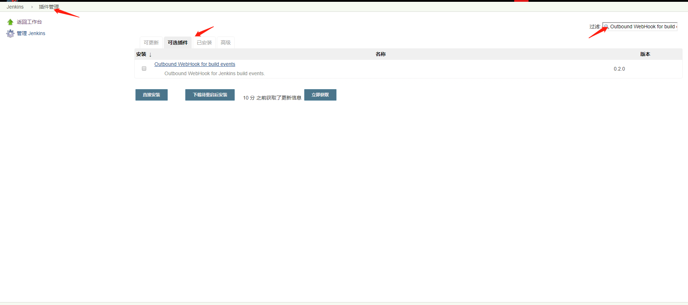
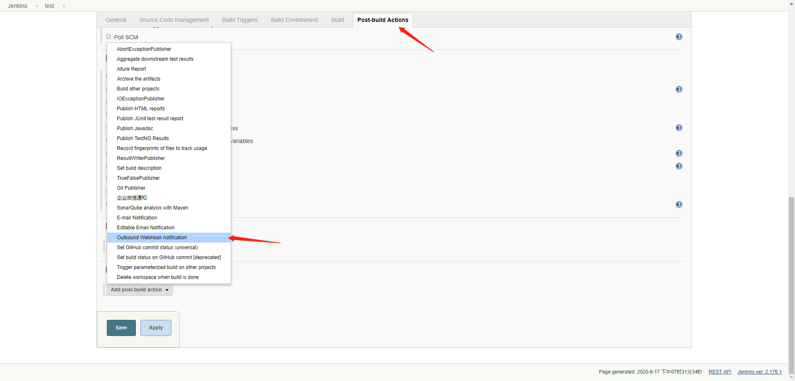
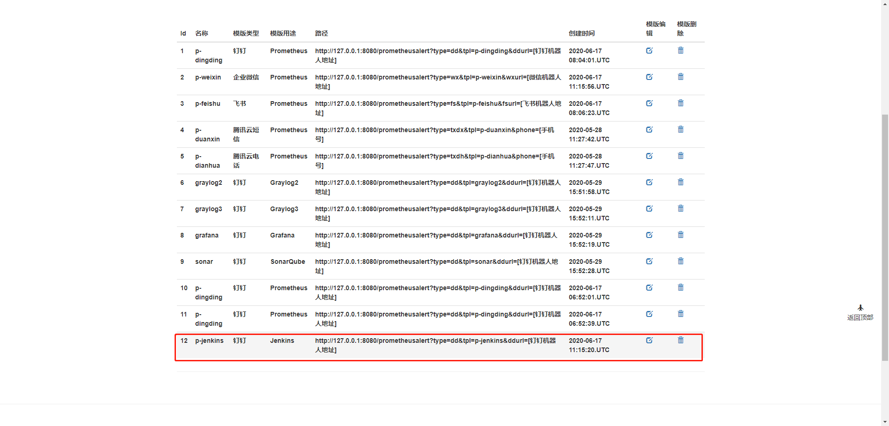
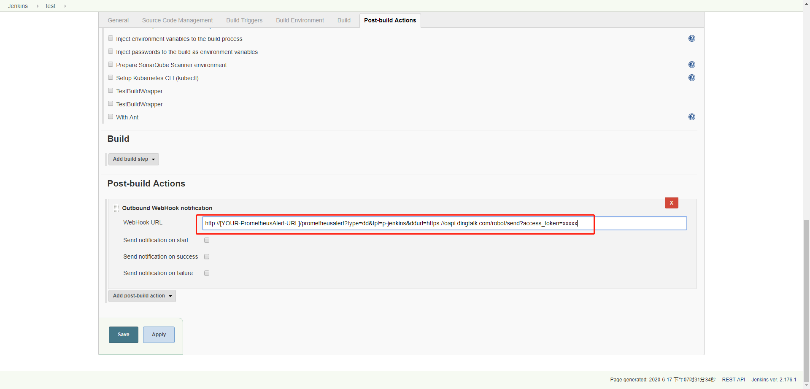
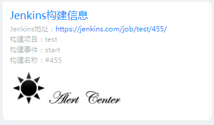

# Jenkins 接入配置
 
首先使用管理员或者具有配置管理权限的帐号登录进Jenkins管理页面，登录后进入`插件管理`-->`可选插件`-->`搜索插件：Outbound WebHook for build events`。
 

 
选中插件安装，并等待安装完成后重启jenkins，以便jenkins加载插件

重启jenkins后，选择任意jenkins Job进入编辑，进入`构建后操作(Post-build Actions)`,添加如图中的`Outbound WebHook notification`
 

然后打开PrometheusAlert Dashboard页面的`AlertTemplate`页面，找到jenkins自定义模版，复制路径栏的内容，如图：

将刚刚复制的路径粘贴到`Outbound WebHook notification`的`WebHook URL`文本框中，并替换成你自己的真实地址：

最终告警效果:
 
