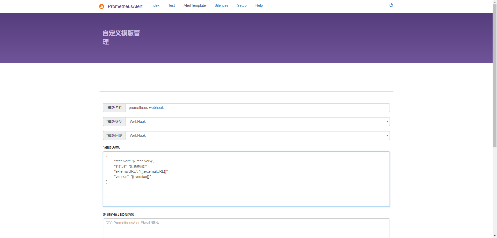
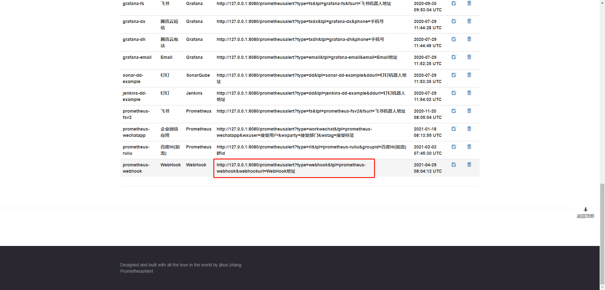

# PrometheusAlert WebHook使用说明

--------------------------------------

PrometheusAlert WebHook是实现将PrometheusAlert收到的消息转发给除了默认支持的告警渠道之外的系统，如部分企业内部系统或接口；同时通过自定义模板实现由用户自行指定发送的json内容。

使用前提：接收WebHook消息的接口需支持POST。且使用该功能需要使用者对go语言的template模版有一些初步了解，可以参考默认模版的一些语法来进行自定义。

模版数据等信息均存储在程序目录的下的`db/PrometheusAlertDB.db`中。

1.下面以一个基础的例子来演示PrometheusAlert WebHook的使用

- 假设现在有一个企业内部的接口（地址：http://127.0.0.1:8080/test）,该接口支持的json协议参考如下：

```
{
	"receiver": "prometheus-alert-center",
	"status": "firing",
	"externalURL": "https://prometheus.io",
	"version": "4"
}
```

- 如果我们需要将PrometheusAlert接收到的Prometheus发过来的告警转发到该接口，且需要满足该接口的json协议，则需要先在PrometheusAlert自定义模板页面新建一个WebHook的模版。模板的内容参考如下：
```
{
	"receiver": "{{.receiver}}",
	"status": "{{.status}}",
	"externalURL": "{{.externalURL}}",
	"version": "{{.version}}"
}
```



---------------------------------------------------------------------
- 对新添加的模版进行测试

- 测试前请先保存模板，并参照[自定义模板使用](customtpl.md),从PrometheusAlert提取接收到的Prometheus的消息json，并将消息json粘贴到页面的`消息协议JSON内容: `中；继续将测试的企业内部接口Url填入`webhook地址`栏里面，点击模板测试按钮开始测试。


- 测试无误后，回到`AlertTemplate`页面并复制页面上刚刚新建的模板的地址（将地址中`WebHook地址`替换成企业内部接口`http://127.0.0.1:8080/test`）。



- 接下来更新下alertmanager的路由配置，配置内容参考如下：

```
- name: 'prometheusalert-all'
  webhook_configs:
  - url: 'http://[prometheusalert_url]:8080/prometheusalert?type=webhook&tpl=prometheus-webhook&webhookurl=http://127.0.0.1:8080/test'
```

- 至此，待PrometheusAlert接收到的Prometheus的告警消息后，便会将消息转发给测试的企业内部接口。
